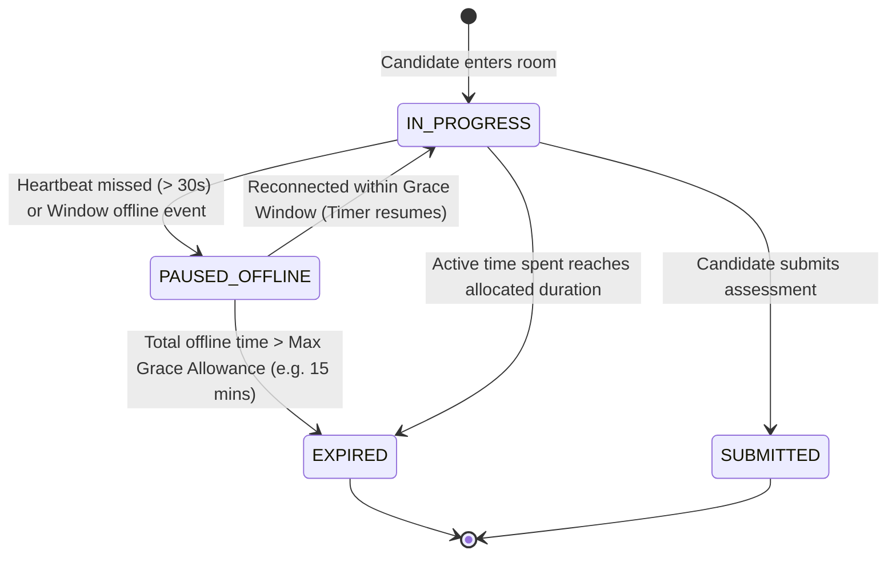

# Architecture Specification: Disconnected Session Pause & Active Time Resumption

## 1. Executive Summary & Problem Statement

In the current implementation of **AI Exam Scribe**, exam session duration is tracked using **wall-clock time** relative to the initial `started_at` timestamp:
$$\text{Remaining Seconds} = (\text{Duration Mins} \times 60) - (\text{Now} - \text{Started At})$$

While this prevents candidates from artificially delaying their submissions, it poses severe usability challenges for **visually impaired learners**:
1. **Assistive Tech Glitches**: Screen readers (NVDA, JAWS, VoiceOver), refreshable braille displays, and voice input engines occasionally crash or require browser restarts.
2. **Connectivity Outages**: Brief Wi-Fi or mobile data drops deduct precious exam time without the candidate having access to questions.
3. **Unfair Penalization**: A 15-minute connection drop during a 60-minute assessment leaves the candidate with only 45 minutes of working time, or causes the session to expire prematurely.

This document specifies the technical design for **Active Connected Time Tracking with Guardrails**, enabling the exam timer to pause during disconnections and resume from where the candidate left off, while strictly protecting exam integrity.

---

## 2. Integrity Principles & Guardrails

To prevent candidates from exploiting the pause feature (e.g., disconnecting intentionally to look up answers offline), the system applies strict integrity guardrails:



### Core Guardrails
1. **Accumulated Active Time (`time_spent_seconds`)**: Time is only deducted while the candidate is actively connected and sending heartbeats.
2. **Maximum Offline Grace Allowance (`max_offline_grace_seconds`)**: Candidates receive an aggregate buffer of disconnected time (default: **15 minutes** per exam). If cumulative offline time exceeds this limit, the session auto-expires.
3. **Absolute Deadline Window (`window_cutoff_at`)**: Regardless of pauses, an exam cannot be submitted beyond an absolute cutoff (e.g., `started_at + 2 * duration_mins` or by end of day).
4. **Proctor & Educator Audit Trail**: Disconnections, reconnections, and durations are logged and visible to teachers on the exam assessment dashboard.

---

## 3. Database Schema Migration

A new migration will add active time accounting and disconnect tracking to the `sessions` table:

```sql
-- Migration 005: Add active time tracking and offline pause accounting to sessions

ALTER TABLE sessions 
    ADD COLUMN IF NOT EXISTS time_spent_seconds INT NOT NULL DEFAULT 0,
    ADD COLUMN IF NOT EXISTS last_heartbeat_at TIMESTAMPTZ,
    ADD COLUMN IF NOT EXISTS total_offline_seconds INT NOT NULL DEFAULT 0,
    ADD COLUMN IF NOT EXISTS disconnect_count INT NOT NULL DEFAULT 0,
    ADD COLUMN IF NOT EXISTS is_paused BOOLEAN NOT NULL DEFAULT FALSE;

-- Index to quickly locate abandoned sessions for background cleanup
CREATE INDEX IF NOT EXISTS idx_sessions_active_heartbeat 
    ON sessions (status, last_heartbeat_at) 
    WHERE status = 'IN_PROGRESS';
```

### Data Dictionary

| Column | Type | Description |
|---|---|---|
| `time_spent_seconds` | `INT` | Total active seconds the student has consumed while connected. |
| `last_heartbeat_at` | `TIMESTAMPTZ` | Timestamp of the last received ping from the candidate's browser. |
| `total_offline_seconds` | `INT` | Cumulative seconds elapsed while disconnected or paused. |
| `disconnect_count` | `INT` | Number of distinct disconnect / reconnect occurrences. |
| `is_paused` | `BOOLEAN` | Whether the session is currently flagged as paused due to missed heartbeats. |

---

## 4. Backend Service & API Specification

### 4.1 Heartbeat Endpoint

**Route:** `POST /api/v1/sessions/:id/heartbeat`  
**Auth:** Bearer Token (Caller must match `session.student_id`)

#### Logic:
```go
func (s *sessionService) Heartbeat(ctx context.Context, sessionID, callerID uuid.UUID) (*HeartbeatResponse, error) {
    sess, err := s.repo.GetByID(ctx, sessionID)
    if err != nil || sess.StudentID != callerID {
        return nil, ErrUnauthorized
    }

    if sess.Status != StatusInProgress {
        return nil, ErrSessionNotInProgress
    }

    now := time.Now().UTC()
    delta := int(now.Sub(sess.LastHeartbeatAt).Seconds())

    // Cap incremental delta to prevent large jumps (e.g. max 30s)
    if delta > 0 && delta <= 30 {
        sess.TimeSpentSeconds += delta
    }

    sess.LastHeartbeatAt = now
    sess.IsPaused = false

    // Check if active duration has been fully consumed
    totalAllowed := sess.ExamDurationMins * 60
    if sess.TimeSpentSeconds >= totalAllowed {
        _ = s.repo.Expire(ctx, sess.ID)
        return nil, ErrSessionExpired
    }

    _ = s.repo.Update(ctx, sess)

    remainingSeconds := totalAllowed - sess.TimeSpentSeconds
    offlineGraceRemaining := MaxOfflineGraceSeconds - sess.TotalOfflineSeconds

    return &HeartbeatResponse{
        RemainingSeconds:      remainingSeconds,
        TimeSpentSeconds:      sess.TimeSpentSeconds,
        IsPaused:              false,
        OfflineGraceRemaining: offlineGraceRemaining,
    }, nil
}
```

### 4.2 Idempotent Start & Resume Calculation

In `StartSession` and `GetSession`:
1. When reconnecting:
   $$\text{Offline Delta} = \text{Now} - \text{last\_heartbeat\_at}$$
2. If $\text{Offline Delta} > 30\text{ seconds}$:
   - `disconnect_count += 1`
   - `total_offline_seconds += Offline Delta`
3. If $\text{total\_offline\_seconds} > \text{MaxOfflineGraceSeconds}$:
   - Session transitions to `EXPIRED`.
   - Returns `ErrSessionExpired` ("Maximum offline reconnection allowance exceeded").
4. If valid:
   - Resumes session.
   - Calculates remaining time based on `time_spent_seconds`.
   - Returns session payload to client.

---

## 5. Frontend Architecture & Accessible UX

### 5.1 Client-Side Heartbeat Hook (`useSessionHeartbeat.ts`)

A React hook embedded in the Exam Room (`/sessions/[id]`):
- Fires every 15 seconds while tab has focus.
- Automatically pauses countdown when `navigator.onLine === false` or `document.visibilityState === 'hidden'` (optional, if configured).
- Listens to `window.addEventListener('online', ...)` to trigger immediate reconnect and re-sync.

### 5.2 Accessible Notification & Banner Design

For visually impaired learners, disconnections must be announced clearly to assistive devices via `aria-live`:

```tsx
{isOffline && (
  <div
    role="alert"
    aria-live="assertive"
    className="fixed top-4 left-1/2 -translate-x-1/2 z-50 rounded-xl bg-amber-500/15 border-2 border-amber-600 p-4 text-amber-900 dark:text-amber-200 shadow-xl"
  >
    <div className="flex items-center gap-3">
      <WifiOff className="size-5 shrink-0 text-amber-600" aria-hidden="true" />
      <div>
        <h4 className="font-bold text-sm">Connection Interrupted · Timer Paused</h4>
        <p className="text-xs mt-0.5">
          Your exam timer has been paused. Please reconnect within {formatTime(graceRemaining)}.
        </p>
      </div>
    </div>
  </div>
)}
```

When reconnected:
- Trigger audio chime or ARIA announcement:
  `"Connection restored. Your assessment timer has resumed."`

---

## 6. Educator & Proctor Visibility

In the Exam Details page (`/exams/[id]`):
- Educators see an **Integrity & Connectivity** column for each assigned candidate:
  - `Connected` (Green pulse)
  - `Paused (Offline 2m 14s)` (Amber)
  - `Completed · 1 disconnect recorded (45s total)` (Audit note)
- Hovering or clicking displays a timeline of disconnection timestamps and reconnect events.

---

## 7. Implementation Checklist (When Resuming)

- [ ] **Backend Database**:
  - [ ] Create `migrations/005_session_active_time.sql` with `time_spent_seconds`, `last_heartbeat_at`, etc.
  - [ ] Update `Session` struct in `internal/session/model.go`.
- [ ] **Backend Session Logic**:
  - [ ] Implement `Heartbeat` service method and repository update.
  - [ ] Add `POST /sessions/:id/heartbeat` in `internal/session/handler.go`.
  - [ ] Update `StartSession` and `GetSession` to compute `remainingSeconds` from `time_spent_seconds`.
  - [ ] Write table-driven unit tests in `internal/session/service_test.go`.
- [ ] **OpenAPI Automation**:
  - [ ] Run `go run cmd/openapi-gen/main.go` to publish the `/sessions/:id/heartbeat` spec.
- [ ] **Frontend Integration**:
  - [ ] Add `heartbeat` method in `apps/frontend/src/services/api.ts`.
  - [ ] Create `useSessionHeartbeat` hook in `apps/frontend/src/hooks/`.
  - [ ] Update countdown timer in `apps/frontend/src/app/(dashboard)/sessions/[id]/page.tsx` to handle paused states.
  - [ ] Add accessible offline banner with `aria-live="assertive"`.
- [ ] **Verification**:
  - [ ] Run backend tests (`go test ./...`).
  - [ ] Run frontend Vitest suite (`npm run test`).
  - [ ] Perform manual network throttle test (Chrome DevTools &rarr; Offline).
