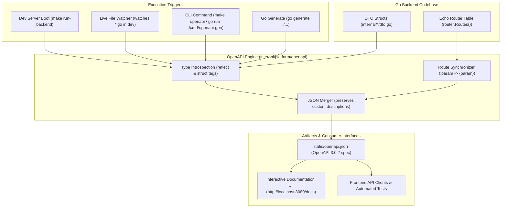

# Automated OpenAPI Documentation System

## 1. Overview & Objective

In modern API development, API documentation often suffers from **documentation drift** — developers modify Go structs, add or alter HTTP routes, or update validation rules, but forget to update the OpenAPI specification file (`static/openapi.json`). Over time, frontend engineers, QA, and API consumers receive stale or incorrect contracts.

To solve this, the AI Exam Scribe backend includes a **native, real-time OpenAPI synchronization engine**. Whenever Go code (DTOs, models, handlers, routes) is updated, the OpenAPI 3.0 specification file is kept up-to-date **automatically**, without manual JSON editing or third-party cloud dependencies.

---

## 2. Architecture & Data Flow



---

## 3. How It Works Under the Hood

### Pillar 1: Type & Schema Introspection (`generator.go`)

The schema engine uses Go's standard `reflect` package to introspect all registered DTO structs and models across domain packages (`auth`, `user`, `exam`, `question`, `assignment`, `session`, `answer`).

1. **Struct Tag Parsing**:
   - `json:"fieldName,omitempty"`: Extracts property names and determines whether a field is omitempty.
   - `validate:"required,..."`: Automatically classifies fields as `required` in the OpenAPI schema.
2. **Type Mapping**:
   | Go Type | OpenAPI Type | Format | Notes |
   | :--- | :--- | :--- | :--- |
   | `string` | `string` | — | Uses `format: "email"` if `validate:"email"` is present |
   | `uuid.UUID` / `*uuid.UUID` | `string` | `uuid` | Handles pointer UUIDs gracefully |
   | `time.Time` / `*time.Time` | `string` | `date-time` | ISO-8601 timestamps |
   | `int`, `int32`, `int16` | `integer` | — | Standard integers |
   | `int64` | `integer` | `int64` | Big integers / epoch milliseconds |
   | `float32`, `float64` | `number` | — | Floating-point values |
   | `bool` | `boolean` | — | True/False flags |
   | `slice` / `array` | `array` | — | Recursively resolves item schemas |
   | `*T` (Pointer) | — | — | Sets `nullable: true` |

3. **Domain Enum Detection**:
   Go domain string aliases are automatically mapped to OpenAPI enum definitions:
   - `exam.Status` &rarr; `["DRAFT", "PUBLISHED", "ARCHIVED"]`
   - `assignment.Status` &rarr; `["ASSIGNED", "REVOKED"]`
   - `session.Status` &rarr; `["PENDING", "IN_PROGRESS", "SUBMITTED", "EXPIRED"]`
   - `question.Type` &rarr; `["MCQ", "ESSAY", "VOICE"]`

4. **Embedded Struct Inlining**:
   When a model embeds common base structures (such as `model.Base`, `BaseWithId`, `BaseWithCreatedAt`, or `BaseWithUpdatedAt`), the engine recursively inspects the embedded fields and inlines `id`, `createdAt`, and `updatedAt` into the final schema.

---

### Pillar 2: Echo Route Table Synchronization

Echo registers all routes in memory at application startup. The OpenAPI engine queries `router.Routes()` to discover active endpoints:

1. **Path Syntax Conversion**:
   Translates Echo's `:param` syntax into standard OpenAPI `{param}` syntax:
   ```text
   /api/v1/exams/:id                 --> /api/v1/exams/{id}
   /api/v1/assignments/exam/:examId  --> /api/v1/assignments/exam/{examId}
   ```
2. **Path Parameter Extraction**:
   Automatically identifies all `{param}` path variables and generates standard OpenAPI parameter definitions (`in: "path"`, `required: true`, `schema: { "type": "string", "format": "uuid" }`).
3. **Route Categorization & Tagging**:
   Categorizes routes into high-level OpenAPI tags based on path prefixes (`Health`, `Auth`, `Exams`, `Questions`, `Assignments`, `Sessions`, `Answers`, `Students`).
4. **Operation Synthesis & Security**:
   For each endpoint, standard error responses (`400 BadRequest`, `401 Unauthorized`, `403 Forbidden`, `404 NotFound`) and authentication requirements (`bearerAuth: []`) are automatically associated.
5. **Wildcard & Internal Route Filtering**:
   Suppresses internal Echo fallback routes (such as `echo_route_not_found` or `/*` static wildcards) to ensure the specification contains only clean, public HTTP endpoints.

---

### Pillar 3: Real-Time Development Watcher (`watcher.go`)

When the server runs in development mode (`cfg.Primary.Env != "production"`):

1. **Boot Sync**: On application startup, the server immediately synchronizes `static/openapi.json` before serving incoming requests.
2. **Background File Watcher**: A lightweight background goroutine polls the modification timestamps of all `.go` files across `apps/backend/internal/` and `apps/backend/cmd/`.
3. **Zero-Latency Debounce**: When any `.go` file is edited and saved, the watcher waits 300ms (to let multi-file saves settle) and re-synchronizes `static/openapi.json` on disk.
4. **Instant UI Refresh**: Refreshing `http://localhost:8080/docs` in your browser immediately displays the new endpoint or struct changes without restarting the server.

---

## 4. Developer Workflows & Commands

### 1. Zero-Friction (Standard Dev Workflow)
Simply run the backend:
```bash
make run-backend
```
Edit any `.go` file in `internal/` or `cmd/`. The background watcher updates `static/openapi.json` automatically:
```text
2026-10-05 16:04:10 INF [openapi] documentation updated automatically from Go code changes component=openapi
```

### 2. Manual CLI Generation
To regenerate the specification on demand without starting databases or servers:
```bash
# From repository root:
make openapi

# Or from apps/backend:
make openapi
# or
go run ./cmd/openapi-gen
```

### 3. Code Generation Directive
The root server file includes a `go:generate` directive:
```bash
go generate ./...
```

### 4. Viewing the Interactive Documentation
Once the server is running, navigate to:
```text
http://localhost:8080/docs
```
The UI loads the live specification served from `/static/openapi.json`.

---

## 5. CI/CD Integration & Contract Testing

To guarantee that code submitted in pull requests matches the checked-in OpenAPI specification, add this step to CI pipelines:

```bash
# Verify openapi.json is in sync with Go code
make openapi
git diff --exit-code apps/backend/static/openapi.json
```
If a developer modified a Go DTO or route without committing the updated `openapi.json`, the CI check fails with a clear diff.

---

## 6. Registering New DTOs

When adding a brand new DTO struct to the backend, add it to the `registry` map in [generator.go](file:///c:/VS%20Code/ai-scribe/apps/backend/internal/platform/openapi/generator.go):

```go
registry := map[string]interface{}{
    // Existing schemas...
    "MyNewFeatureRequest":  myfeature.MyNewFeatureRequest{},
    "MyNewFeatureResponse": myfeature.MyNewFeatureResponse{},
}
```
Run `make openapi` and the new schema will immediately be extracted and merged into `components.schemas` in `static/openapi.json`.
