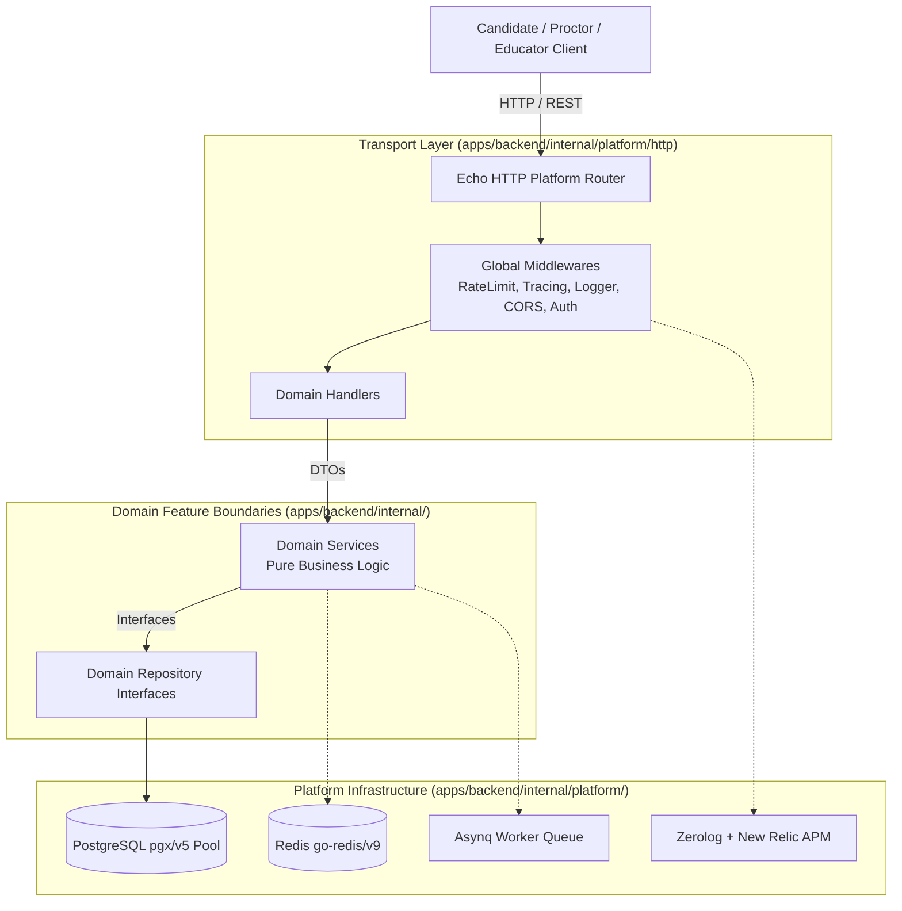
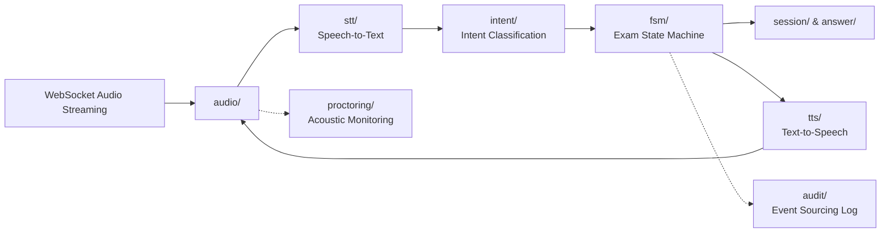

# AI Exam Scribe - Architecture Overview

## 1. Executive Architecture Summary

The **AI Exam Scribe** is architected as an enterprise-grade **Go Modular Monolith**. It provides a voice-first, accessible examination platform designed specifically for visually impaired candidates.

This foundation establishes strict structural boundaries, explicit dependency inversion, and isolated platform infrastructure, allowing the system to scale reliably while preserving clear extraction seams for future high-load microservices (e.g., real-time audio processing, telemetry, and event sourcing).



---

## 2. Application Entry Point (`cmd/server/main.go`)

The entry point serves strictly as the **Composition Root** of the application. It has zero business logic and is responsible for:
1. **Configuration Loading**: Loading environment variables via `internal/platform/config` with support for `SCRIBE_` and legacy `BOILERPLATE_` prefixes.
2. **Observability Initialization**: Setting up structured Zerolog logging and New Relic APM agents via `internal/platform/logger`.
3. **Database Connection Pool**: Initializing the `pgx/v5` PostgreSQL connection pool via `internal/platform/database`.
4. **Database Migrations**: Executing pending Tern schema migrations embedded in `migrations/`.
5. **Redis & Background Workers**: Initializing Redis client and Asynq background workers via `internal/platform/redis` and `internal/platform/job`.
6. **Dependency Injection**: Explicit constructor injection assembling repositories, domain services, and HTTP handlers.
7. **HTTP Server & Routing**: Registering route groups (`/status`, `/docs`, `/static`, `/api/v1`) and starting the HTTP server with graceful shutdown on `os.Interrupt` / `SIGTERM`.

---

## 3. Layer Responsibilities & Dependency Rules

Every business feature enforces the unidirectional flow:

$$\text{Request} \longrightarrow \text{Handler} \longrightarrow \text{Service} \longrightarrow \text{Repository} \longrightarrow \text{Platform Database} \longrightarrow \text{PostgreSQL}$$

### A. Handlers (`internal/<domain>/handler.go`)
- **Transport Binding**: Parses HTTP requests, URL parameters, and headers using `labstack/echo/v4`.
- **Validation**: Enforces request schema correctness using `validation.BindAndValidate`.
- **DTO Mapping**: Converts HTTP request bodies into domain DTOs, and domain responses into API responses.
- **HTTP Status Codes**: Maps domain results and errors to appropriate HTTP status codes (200, 201, 400, 404, 500).
- **Rule**: Handlers must never perform database queries or business computations directly.

### B. Services (`internal/<domain>/service.go`)
- **Core Business Logic**: Orchestrates business rules, state transitions, domain validation, and policy checks.
- **Pure Go Interfaces**: Declared as Go interfaces (`Service`) with concrete implementations accepting `Repository` interfaces and logger instances.
- **Decoupled from Transport**: Services have **no dependency** on Echo, `http.Request`, `http.ResponseWriter`, or HTTP headers.
- **Decoupled from Database**: Services interact only with domain entities and repository interfaces, never executing raw SQL queries or handling database connection pools.

### C. Repositories (`internal/<domain>/repository.go`)
- **Data Access Abstraction**: Encapsulates persistence logic behind clean Go interfaces (`Repository`).
- **PostgreSQL Implementation**: Implemented against `*pgxpool.Pool` from `internal/platform/database`.
- **Error Translation**: Translates SQL/PostgreSQL driver errors into domain errors or structured database errors via `sqlerr`.

---

## 4. Platform Infrastructure (`internal/platform/`)

Shared technical concerns are isolated in `internal/platform/`, completely separated from business logic:

| Component | Package Path | Purpose |
|---|---|---|
| **Config** | `internal/platform/config` | Koanf-based configuration loader with validator integration and observability configurations. |
| **Logger** | `internal/platform/logger` | Zerolog JSON logger with New Relic log forwarding and SQL query tracing. |
| **Database** | `internal/platform/database` | `pgx/v5` connection pool with query tracing, ping health checks, and Tern migration runner. |
| **SQL Errors** | `internal/platform/database/sqlerr` | PostgreSQL constraint violation mapper (unique, FK, not null, check) to user-friendly messages. |
| **Redis** | `internal/platform/redis` | `go-redis/v9` client with New Relic APM hooks. |
| **HTTP** | `internal/platform/http` | Echo router configuration, server lifecycle, response helpers, and system endpoints (`/status`, `/docs`). |
| **Middleware** | `internal/platform/http/middleware` | Rate limiting (in-memory token bucket), CORS, security headers, request ID, New Relic tracing, and unified error handling. |
| **Job Queue** | `internal/platform/job` | Asynq distributed background task processor (priority queues: critical, default, low). |
| **Email** | `internal/platform/email` | Resend API client with HTML template execution. |
| **Validation** | `internal/platform/validation` | Struct validation utilities and UUID regex matchers. |

---

## 5. Domain Layout

Business domains are organized by feature packages under `internal/`:

```text
internal/
├── auth/          # Identity, token validation, and session claims
├── user/          # Candidate and educator management
├── exam/          # Examination schedules, durations, and definitions
├── question/      # Item bank, prompts, and scoring weight
├── assignment/    # Candidate allocations to scheduled exams
├── session/       # Active exam runtime and timing enforcement
└── answer/        # Candidate responses and transcript records
```

Each feature package encapsulates its own models, DTOs, errors, repository interfaces, services, and handlers.

---

## 6. Database Access & Migrations

- **Connection Pool**: `pgxpool.Pool` provides production-grade connection reuse, configurable min/max connections, and connection lifetime management.
- **Tracer**: Query execution is traced via `nrpgx5` in production and logged locally with duration formatting in local development.
- **Migrations**: Schema migrations are stored in `/migrations/*.sql` and embedded directly into the Go binary using `embed.FS` in `migrations/migrations.go`.
- **Runner**: Tern migration runner (`tern/v2`) applies all pending migrations deterministically on startup when outside local development.

---

## 7. Testing Architecture

Testing is split cleanly into isolated tiers:

```text
tests/
├── integration/     # Testcontainers (PostgreSQL + Redis) and transaction rollback helpers
└── helpers/         # Custom assertions (timestamps, UUIDs, string matching)
```

- **Unit Tests**: Co-located with code in `*_test.go` files (e.g. `internal/exam/service_test.go`, `internal/platform/config/config_test.go`, `internal/platform/http/handler/health_test.go`).
- **Integration Tests**: Leverage `testcontainers-go` to spin up ephemeral PostgreSQL 16 containers and verify migration execution and repository operations against a real database.

---

## 8. Future AI Scribe Component Integration

The modular monolith is explicitly partitioned to accommodate future voice and AI subsystems without disrupting the core domain structure:



| Component | Target Location | Architectural Role |
|---|---|---|
| **FSM** | `internal/fsm/` | Pure deterministic finite state machine governing candidate exam states (`ReadingQuestion`, `Answering`, `Reviewing`, `Paused`, `Submitted`). Pure domain logic without HTTP or DB dependencies. |
| **WebSocket** | `internal/platform/ws/` | Transport layer protocol adapter for duplex audio and binary event streaming. |
| **Audio** | `internal/audio/` | Low-latency audio buffer management, PCM/Opus encoding/decoding, and streaming pipeline. |
| **STT** | `internal/stt/` | Pluggable speech-to-text adapter (Deepgram, Whisper, Google Cloud Speech) converting candidate speech to text tokens. |
| **Intent** | `internal/intent/` | Natural language intent parser classifying speech commands (e.g., "Repeat question", "Next question", "Submit answer", "Flag for review"). |
| **TTS** | `internal/tts/` | Pluggable text-to-speech adapter (ElevenLabs, Google Cloud TTS) producing synthesized audio for question presentation. |
| **Audit** | `internal/audit/` | Append-only event store logging every voice interaction, state transition, and proctoring event for non-repudiation. |
| **PDF Ingestion**| `internal/document/` | Extraction engine parsing exam papers, structuring questions, and creating accessible graph/text descriptions. |
| **Accessibility**| `internal/accessibility/` | Sonification engine translating diagrams, tables, and mathematical notations into spatial audio signals. |
| **Proctoring** | `internal/proctoring/` | Background telemetry analysis monitoring acoustic anomalies and session integrity. |
